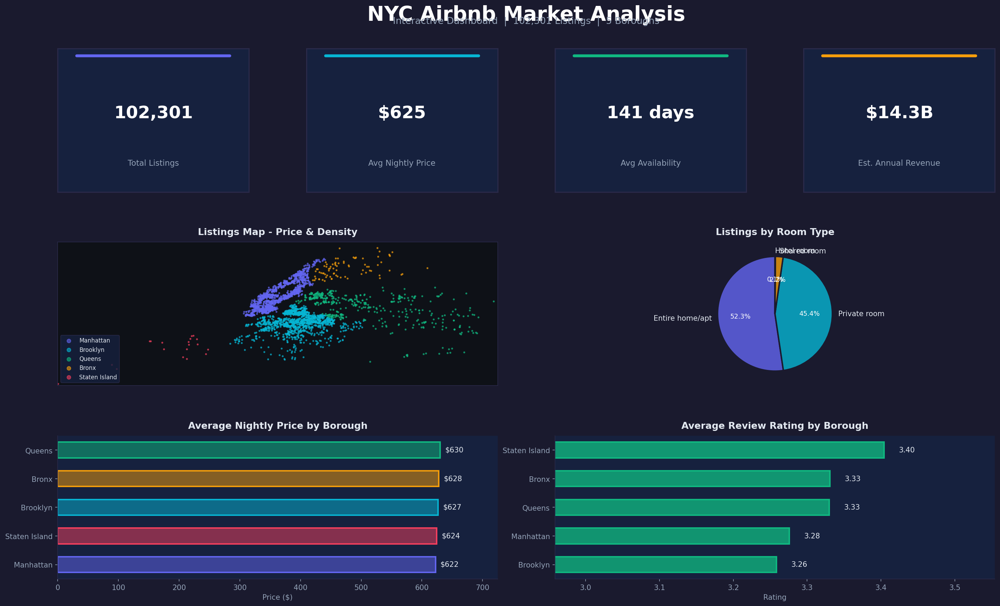
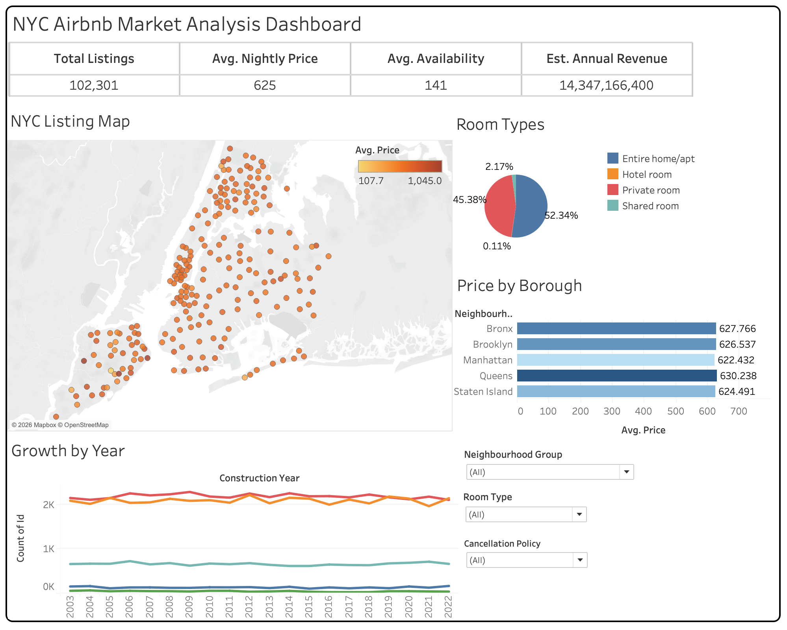

# NYC Airbnb Market Analysis

> End-to-end data analytics project: **Python (Pandas, Matplotlib, Seaborn)** for data cleaning & EDA, **Tableau** for interactive dashboarding.

---

## Project Overview

Analyzed **102,301 Airbnb listings** across New York City's 5 boroughs to uncover pricing patterns, room type distributions, borough-level trends, and review behavior. The project follows a complete analytics pipeline — from raw data wrangling to visual storytelling through an interactive Tableau dashboard.

---

## Tableau Dashboard



The interactive dashboard includes:
- **4 KPI Cards** — Total Listings, Avg Price, Avg Availability, Est. Annual Revenue
- **Map** — Neighbourhood-level geographic distribution with price color encoding
- **Bar Charts** — Avg Price by Borough, Review Ratings by Borough
- **Pie Chart** — Room Type breakdown
- **Line Chart** — Listings growth over time
- **Cross-Filters** — Borough, Room Type, Cancellation Policy

> Open `NYC_Airbnb_Market_Analysis.twb` in Tableau Desktop to explore interactively.

<!-- Add your Tableau Public link here after publishing:
[View Live Dashboard](https://public.tableau.com/your-link-here)
-->

---

## Project Structure

| File | Description |
|---|---|
| `data_cleaning.ipynb` | 14-step data cleaning pipeline — handles nulls, typos, currency parsing, type fixes |
| `exploratory_analysis.ipynb` | EDA with 8 analysis sections, statistical insights, and matplotlib/seaborn visualizations |
| `cleaned_airbnb_final.csv` | Cleaned dataset (102,301 rows x 24 columns) — ready for analysis |
| `NYC_Airbnb_Market_Analysis.twb` | Interactive Tableau dashboard with maps, charts, KPIs, and cross-filters |

---

## Data Cleaning Highlights

The raw Airbnb Open Data had significant quality issues. Key cleaning steps:

- **Dropped** `license` (99.99% null) and `house_rules` (50%+ null)
- **Parsed** `price` & `service_fee` from strings (`"$966"`) to float
- **Fixed typos** in borough names (`brookln` to `Brooklyn`, `manhatan` to `Manhattan`)
- **Handled nulls** across 12 columns using median fill, zero fill, and domain-specific defaults
- **Standardized** column names to `lowercase_with_underscores`
- **Converted** `construction_year` from float to int, parsed `last_review` as datetime

**Result:** 102,301 clean rows from 102,599 raw rows (99.7% retention).

---

## Key Insights from EDA

| # | Insight | Evidence |
|:---:|---|---|
| 1 | **Manhattan + Brooklyn dominate the market** | Together they hold 83% of all listings |
| 2 | **Entire home/apt is king** | 52%+ of listings; commands highest avg price |
| 3 | **Price does not equal Quality** | Near-zero correlation (-0.005) between price and review ratings |
| 4 | **Service fee is a fixed 20% markup** | 0.999 correlation with nightly price |
| 5 | **15.5% of listings have zero reviews** | Indicates inactive hosts or brand-new listings |
| 6 | **Staten Island is the hidden gem** | Fewest listings but highest avg review rating |
| 7 | **Strict cancellation = higher price** | Premium hosts charge more and set tighter policies |
| 8 | **Top neighbourhoods cluster in Manhattan and Brooklyn** | Bedford-Stuyvesant, Williamsburg, Harlem, Hell's Kitchen |

---


## Tools and Technologies

| Tool | Usage |
|---|---|
| **Python 3** | Data cleaning and analysis |
| **Pandas** | Data manipulation, null handling, type conversion |
| **Matplotlib and Seaborn** | EDA visualizations — histograms, bar charts, heatmaps |
| **Tableau Desktop** | Interactive dashboard with maps, charts, and filters |
| **Jupyter Notebook** | Development environment |

---

## How to Run

### Prerequisites
```
Python 3.8+
pip install pandas numpy matplotlib seaborn
Tableau Desktop (for .twb file)
```

### Steps
1. Clone the repo:
   ```bash
   git clone https://github.com/dev3306-ai/NYC-Airbnb-Market-Analysis-Python-Tableau.git
   cd NYC-Airbnb-Market-Analysis-Python-Tableau
   ```
2. Run **data_cleaning.ipynb** to see the full cleaning pipeline
3. Run **exploratory_analysis.ipynb** to reproduce all EDA charts and insights
4. Open **NYC_Airbnb_Market_Analysis.twb** in Tableau Desktop to explore the dashboard

---

## Resume Bullet Points

```
NYC Airbnb Market Analysis  |  Python, Pandas, Tableau
- Cleaned and preprocessed 102,301 Airbnb listings using Python (Pandas),
  handling nulls, type errors, currency formatting, and categorical typos
- Performed EDA with correlation analysis, distribution plots, and borough-level
  comparisons; uncovered that price has zero correlation with review ratings
- Built a 5-chart interactive Tableau dashboard with KPIs, geographic map,
  and cross-filters for borough, room type, and cancellation policy
```

---

## Coursework Context

This project aligns with the curriculum of the **Data Visualization and Analytics (DVA)** coursework, demonstrating practical application of key concepts such as Tableau interfaces, data types, dimensions vs. measures, and data connections.



---

## Dataset

**Source:** [Airbnb Open Data on Kaggle](https://www.kaggle.com/datasets/arianazmoudeh/airbnbopendata)
**Size:** 102,599 rows x 26 columns (raw) | 102,301 rows x 24 columns (cleaned)
**Coverage:** New York City — Manhattan, Brooklyn, Queens, Bronx, Staten Island